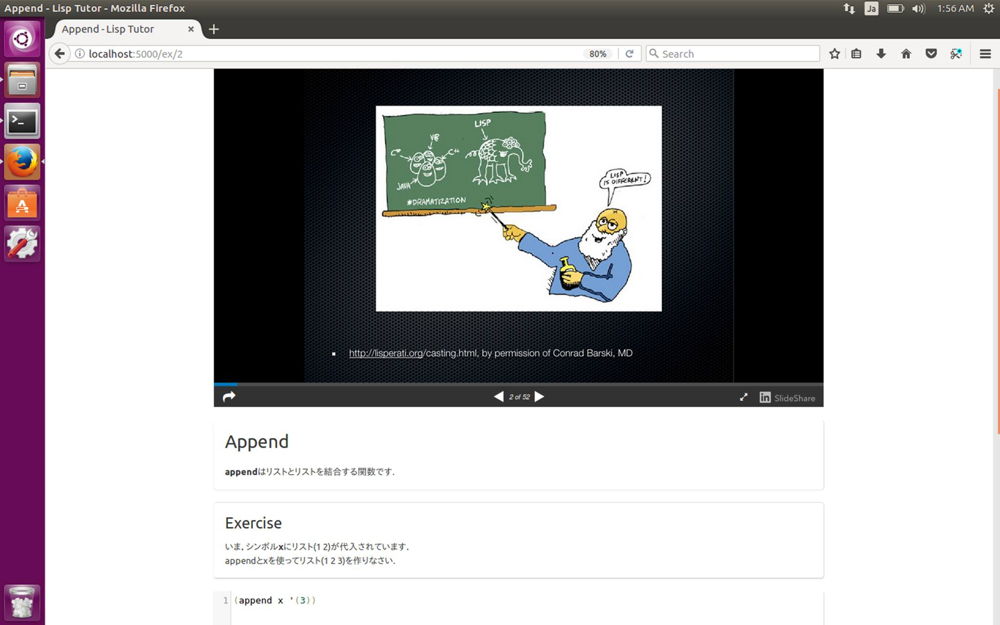

# cl-exercise




## Who We Are
We are tcool, a Common Lisp training facility in Nara, Japan.

We develop a Common Lisp learning system, cl-exercise.

## Our Mission
Our mission is to increase the number of Common lispers in the world.

Why?

Because we love Common Lisp.

## Usage

```lisp
(ql:quickload :cl-exercise)
(cl-exercise:start)
```

## Requirement
* ASDF3
* Quicklisp
* jsonrpc
* darkmatter

## Installation
```bash
# install jsonrpc and darkmatter
$ cd ~/quicklisp/local-projects
$ git clone https://github.com/fukamachi/jsonrpc
$ git clone -b refactor https://github.com/tamamu/darkmatter

$ cd ~/lisp 
$ git clone https://github.com/t-cool/cl-exercise.git

$ sbcl

* (ql:quickload :cl-exercise)
* (cl-exercise:start)

```

## Authors

Lispers in the world


## Copyright

Copyright (c) 2017 tcool, Eddie

## License

Licensed under the MIT License.
